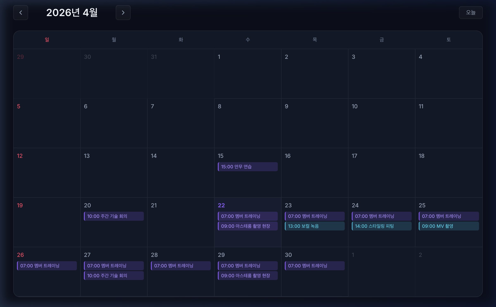

# 아스테룸 통합 스케줄러 (Asterum Integrated Scheduler)

아티스트와 유관 부서가 한곳에서 일정을 투명하게 공유하고, 변화하는 촬영 변수에 유연하게 대응할 수 있는 **통합 일정 관리 시스템**입니다.



---

## 요구사항 및 기능 상세 정리 (Requirements & Features)

본 프로젝트는 아티스트와 유관 부서가 유기적으로 소통할 수 있도록 다음의 핵심 요구사항을 충족하여 구현되었습니다.

### 1. 일회성 및 반복 일정 관리 (Schedule Management)
*   **일회성 일정 (MVP 1)**: 특정 날짜에 발생하는 단발성 일정을 등록하고 관리합니다. (제목, 설명, 일시, 장소, 참여자 지정 가능)
*   **반복 일정 (MVP 2)**: 정기 회의, 연습 등 주기적으로 발생하는 일정을 관리합니다.
    *   **반복 주기**: 매일(Daily), 매주(Weekly), 매월(Monthly) 지원.
    *   **종료 조건**: 무기한(Never), 특정 날짜까지(Until Date), 특정 횟수만큼(Count) 설정 가능.
    *   모든 일정을 DB에 적재하지 않고, **하나의 반복 규칙(RecurrenceGroup)**을 저장한 뒤 조회 시점에 해당 날짜들만 계산하여 반환.

### 2. 반복 일정의 유연한 수정·삭제 (Edit Scope)
구글 캘린더와 동일한 패턴을 적용하여, 반복 일정 중 일부만 변경해야 하는 예외 상황을 처리합니다.
*   **이 일정만 (THIS)**: 선택한 특정 날짜의 가상 인스턴스를 실제 DB 레코드(Exception)로 실체화하여 해당 날짜만 변경/삭제.
*   **이후 모든 일정 (THIS_AND_FOLLOWING)**: 기존 반복 규칙을 전날 자로 조기 종료시키고, 변경된 내용으로 새로운 반복 규칙을 생성하여 이어갑니다.
*   **전체 일정 (ALL)**: 반복 규칙 원본 자체를 수정하여 해당 시리즈에 속한 모든 일정에 일괄 적용합니다.

### 3. 자원 예약 동시성 제어 및 중복 방지 (Resource Concurrency)
스튜디오, 녹음실 등 한정된 자원에 대한 중복 예약을 방지하기 위한 로직을 구현했습니다.
*   **2단계 충돌 검증**: 1단계로 기존에 저장된 일정과 시간 교차(Overlap)를 검사하고, 2단계로 전개된 반복 일정 인스턴스와의 시간 충돌을 확인합니다.
*   **비관적 락(Pessimistic Lock)**: 다중 요청 시 발생하는 **Race Condition**을 방지하기 위해 데이터베이스 수준의 쓰기 잠금(`PESSIMISTIC_WRITE`)을 사용하여 요청을 직렬화했습니다.

### 4. 확장성 및 편의 기능 (UX & Extension)
*   **유형 전환 (일회성 → 반복)**: 기존에 등록된 일회성 일정을 삭제 없이 반복 일정 시리즈로 전환할 수 있습니다.
*   **팀 단위 할당**: 개별 멤버뿐만 아니라, 특정 팀 전체를 일정에 한 번에 할당할 수 있도록 구조화했습니다.

---

## 기술 스택

| 구분 | 기술 |
|------|------|
| Backend | Spring Boot 4.0.5, Java 21 |
| Frontend | React 18, TypeScript, Vite 5 |
| Database | PostgreSQL 16 (Docker) / H2 (로컬 테스트용) |
| ORM | Spring Data JPA (Hibernate 7) |
| API Docs | SpringDoc OpenAPI (Swagger) |
| Design | Custom CSS |
| Infra | Docker, Docker Compose |

---

## 아키텍처

### 반복 일정 전략: 규칙 저장 + 예외 저장 방식

```
RecurrenceGroup (규칙)         Schedule (예외 인스턴스)
┌─────────────────────┐       ┌────────────────────────┐
│ type: WEEKLY         │  ──►  │ date: 2026-04-27       │
│ startDate: 04-20     │       │ title: "특별 회의"      │
│ endDate: 06-30       │       │ isException: true       │
│ dayOfWeek: MON       │       └────────────────────────┘
└─────────────────────┘
```

1. **규칙만 저장**: 365건의 행 대신 규칙 1건만 저장
2. **동적 전개**: 월별 조회 시 규칙 기반으로 인스턴스 계산
3. **예외 처리**: 개별 수정/삭제 시에만 실체화(materialize)

### 수정 범위별 처리

| 범위 | 동작 |
|------|------|
| 이 일정만 | 해당 날짜를 예외 인스턴스로 실체화 |
| 이후 모든 일정 | 기존 규칙 종료 → 새 규칙 생성 |
| 전체 일정 | 규칙 원본 직접 수정 |

### 인프라: Nginx 리버스 프록시

Docker Compose 환경에서 Nginx를 리버스 프록시로 구성하여 다음과 같이 역할을 분담했습니다.
*   **정적 자원 서빙**: 빌드된 React 프론트엔드 파일을 직접 서빙합니다.
*   **API 프록시**: 모든 API 요청(`/api/**`)을 백엔드 컨테이너로 전달하여 CORS 문제를 방지하고 단일 경로를 제공합니다.
*   **Swagger 접근**: `/swagger-ui.html` 요청을 백엔드로 프록시하여 외부에서 API 문서를 즉시 확인할 수 있도록 설정했습니다.

---

## 실행 방법

### 사전 요구사항
- Java 21+
- Node.js 18+

### 백엔드 실행
```bash
cd scheduler
./gradlew bootRun
```
→ http://localhost:8080 에서 API 서버 시작
→ http://localhost:8080/swagger-ui.html 에서 API 문서 확인
→ http://localhost:8080/h2-console 에서 DB 콘솔 (JDBC URL: `jdbc:h2:file:./data/scheduler`)

### 프론트엔드 실행
```bash
cd scheduler/frontend
npm install
npm run dev
```
→ http://localhost:5173 에서 프론트엔드 접속

> 시드 데이터(5개 팀, 12명 멤버, 5개 장소)가 최초 실행 시 자동 생성됩니다.

### Docker로 실행 (권장)
```bash
docker compose up --build
```
→ http://localhost:3000 에서 프론트엔드 접속
→ http://localhost:8080/swagger-ui.html 에서 API 문서 확인

중지 및 정리:
```bash
docker compose down           # 컨테이너 중지
docker compose down -v        # 컨테이너 + 데이터 볼륨 삭제
```

---

## 주요 API

| Method | Endpoint | 설명 |
|--------|----------|------|
| `GET` | `/api/schedules?year=&month=` | 월별 일정 조회 (반복 동적 전개 포함) |
| `POST` | `/api/schedules` | 일정 등록 (일회성/반복) |
| `PUT` | `/api/schedules/{id}` | 일회성 일정 수정 |
| `PUT` | `/api/schedules/recurring/{groupId}/{date}?scope=` | 반복 일정 수정 |
| `DELETE` | `/api/schedules/{id}` | 일회성 일정 삭제 |
| `DELETE` | `/api/schedules/recurring/{groupId}/{date}?scope=` | 반복 일정 삭제 |
| `POST` | `/api/schedules/{id}/convert-to-recurring` | 일회성→반복 전환 |
| `GET` | `/api/members` | 멤버 목록 |
| `GET` | `/api/teams` | 팀 목록 (소속 멤버 포함) |
| `GET` | `/api/resources` | 장소 목록 |

---

## 프로젝트 구조

```
scheduler/
├── src/main/java/com/vlast/scheduler/
│   ├── config/          # CORS 설정
│   ├── common/          # 예외 처리
│   ├── member/          # 팀 & 멤버 (Entity, Repository, Service, Controller, DTO)
│   ├── resource/        # 장소/리소스
│   ├── schedule/        # 일정 & 반복 규칙
│   │   ├── service/
│   │   │   ├── ScheduleService.java          # 핵심 비즈니스 로직
│   │   │   ├── RecurrenceService.java        # 반복 일정 동적 전개
│   │   │   └── ResourceValidationService.java # 중복 예약 검증
│   │   └── ...
│   └── init/            # 시드 데이터
├── frontend/
│   ├── src/
│   │   ├── components/
│   │   │   ├── calendar/   # 월간 달력
│   │   │   ├── schedule/   # 일정 모달, 상세, 범위 선택
│   │   │   └── ui/         # 공통 UI
│   │   ├── api/            # API 클라이언트
│   │   └── types/          # TypeScript 타입
│   └── ...
└── build.gradle
```


